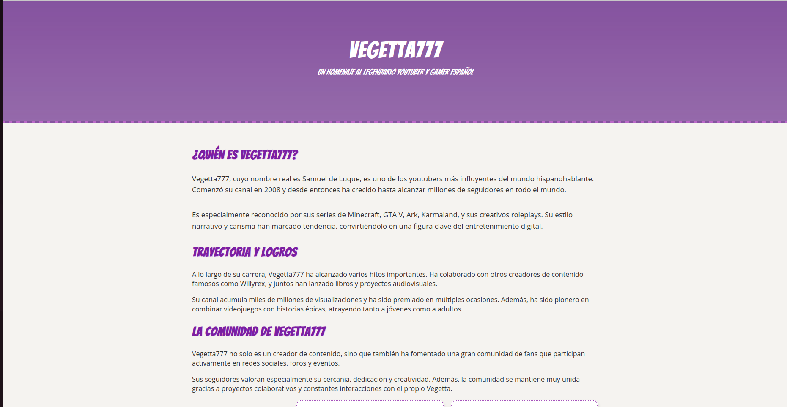
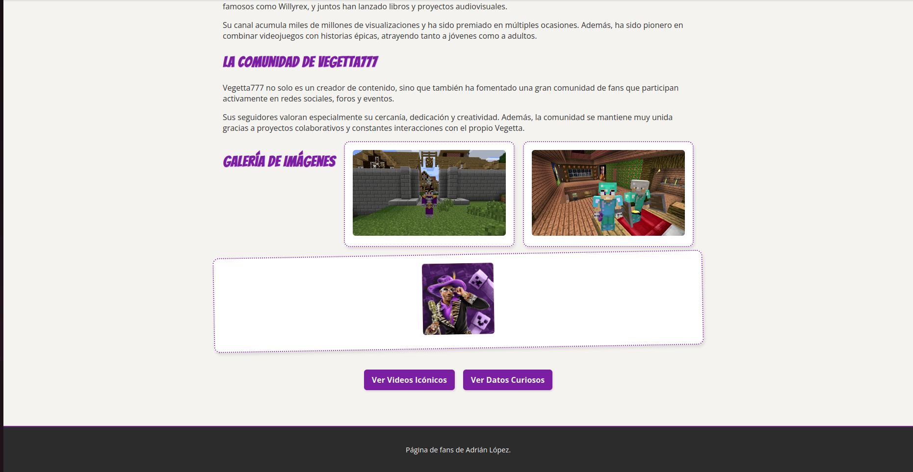
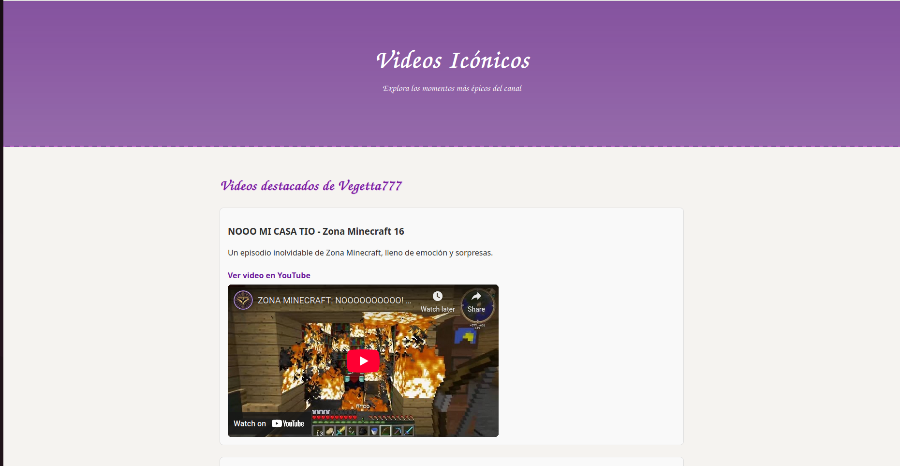
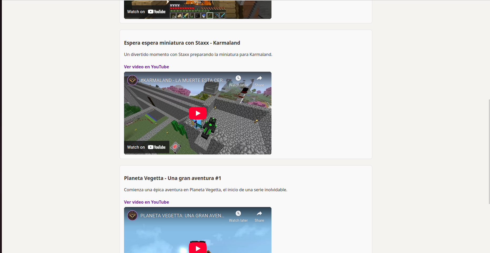
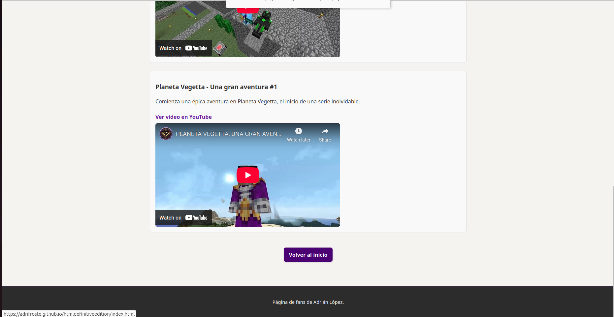
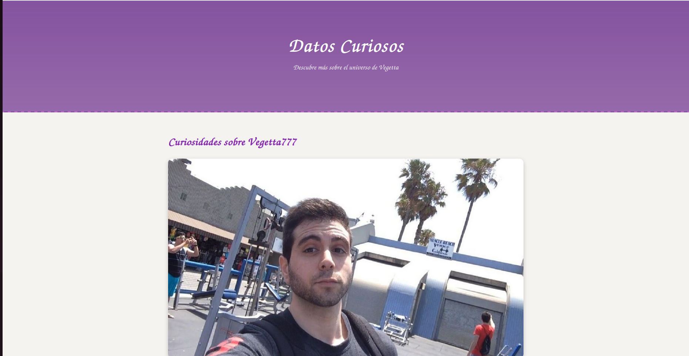
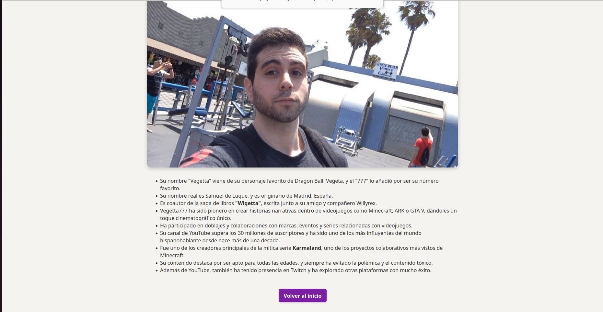

# Página de fans de Vegetta777

Este proyecto es una página web dedicada a uno de los youtubers más influyentes en el mundo hispanohablante: **Vegetta777**. Está creada con HTML5 y CSS, como parte de un ejercicio para aprender desarrollo web.

---

## Descripción del proyecto

La página está pensada como un homenaje al legendario youtuber y gamer español Samuel de Luque, conocido como Vegetta777. Ofrece información sobre su trayectoria, comunidad, una galería de imágenes y enlaces a vídeos icónicos, además de datos curiosos.

---

## Estructura

- **Página principal:** Presenta quién es Vegetta777, su carrera, la comunidad y una galería de imágenes representativas.
- **Página de vídeos:** Recopilación de enlaces a vídeos destacados y momentos épicos.
- **Página de datos curiosos:** Información interesante y una imagen representativa del creador.

Las páginas están conectadas entre sí mediante enlaces de navegación que facilitan la exploración del sitio.

---

## Diseño y Estilo

El diseño utiliza una paleta de colores morados y lilas, con un header que combina una imagen de fondo y un degradado semitransparente para destacar el título. Se ha empleado la tipografía 'Bangers' para los títulos y 'Open Sans' para el texto general.

La galería de imágenes está organizada con Flexbox, presentando cards con bordes punteados y sombras suaves para dar un toque personal y poco "perfecto". Se incluyen animaciones y efectos hover para hacer la experiencia más dinámica.

Se ha buscado un estilo con un toque artesanal, con algunos elementos imperfectos a propósito para evitar que parezca generado automáticamente o demasiado pulido.

---

## Tecnologías usadas

- HTML5
- CSS3 (Flexbox, animaciones, transiciones)
- Google Fonts (Bangers, Open Sans)

---

## Reflexión personal

Este proyecto ha sido una gran oportunidad para practicar y aplicar los conocimientos de HTML y CSS aprendidos en clase. He mejorado en la organización del código, manejo de estilos y diseño responsive básico.

Además, el tema me ha motivado a dar lo mejor, porque me encanta Vegetta777 y quería reflejar su personalidad y legado en la página.

Aunque es un proyecto sencillo, estoy orgulloso del resultado y de cómo he conseguido un estilo propio y agradable para el usuario.

---

## Cómo ejecutar el proyecto

Solo necesitas abrir el archivo `index.html` en cualquier navegador moderno para ver la página principal. Desde ahí, podrás navegar a las demás secciones.

---

## Capturas de la web

